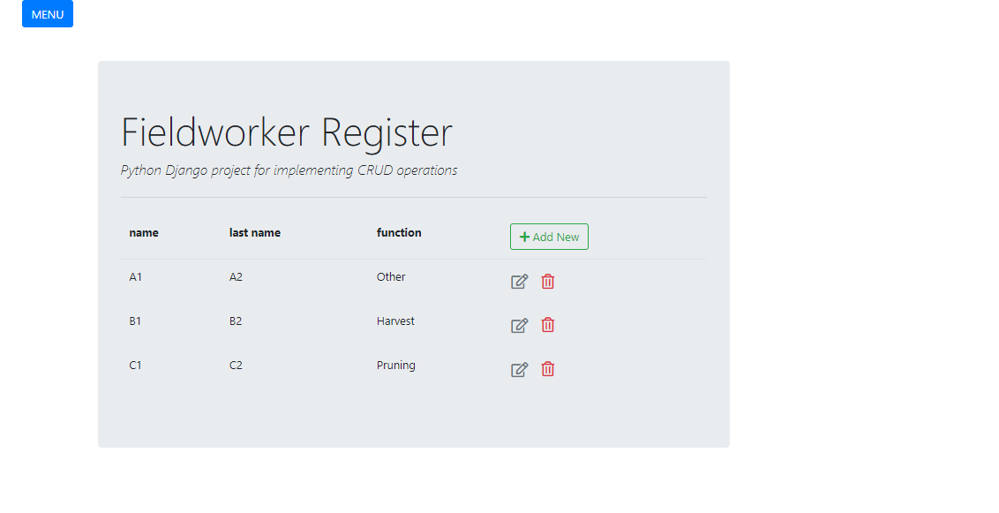
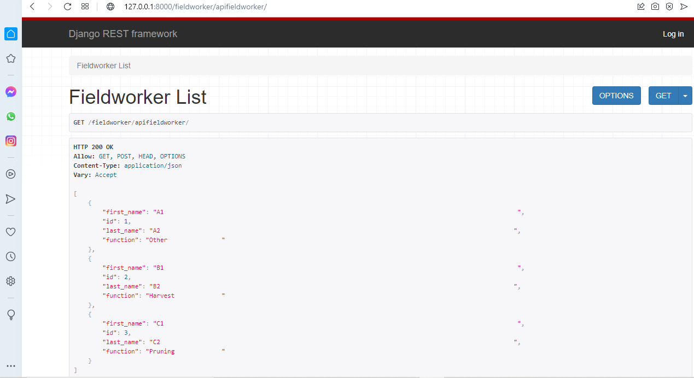
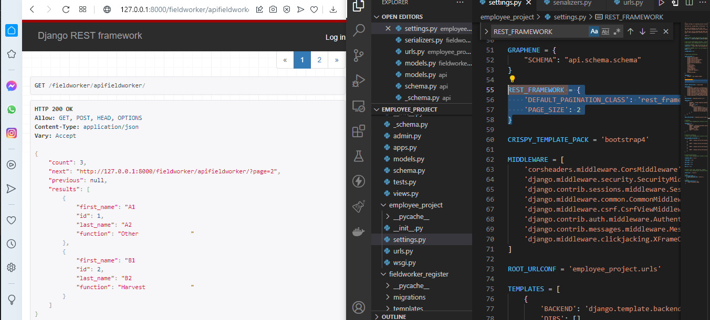

# AG

Author: DR

## Instrucciones:

...

### Constraints

api funcional. 
* ...
    1. crear, listar, actualizar y borrar trabajadores de campo

### Campos:
d (UUID)
first_name 
last_name
function (Opciones: Harvest, Pruning, Scouting, Other)
created_at (datetime: automático)

### Extras
- Si puedes levantar un entorno con docker, te invitamos a que lo hagas.
- Nos gustaría ver que puedes generar un test con los casos de usos básicos.

### python commands

python manage.py makemigrations
python manage.py migrate

python manage.py makemigrations fieldworker_register

python manage.py runserver

### DataBase

CREATE TABLE public.fieldworker
(
    id serial PRIMARY KEY,
    first_name character(100)  NOT NULL,
    last_name character(100)  NOT NULL,
	function character(20)  NOT NULL,
	created_at date NOT NULL
)
TABLESPACE pg_default;
ALTER TABLE public.fieldworker
    OWNER to postgres;
	
### API

http://127.0.0.1:PORT/fieldworker/api
	

### pagination

